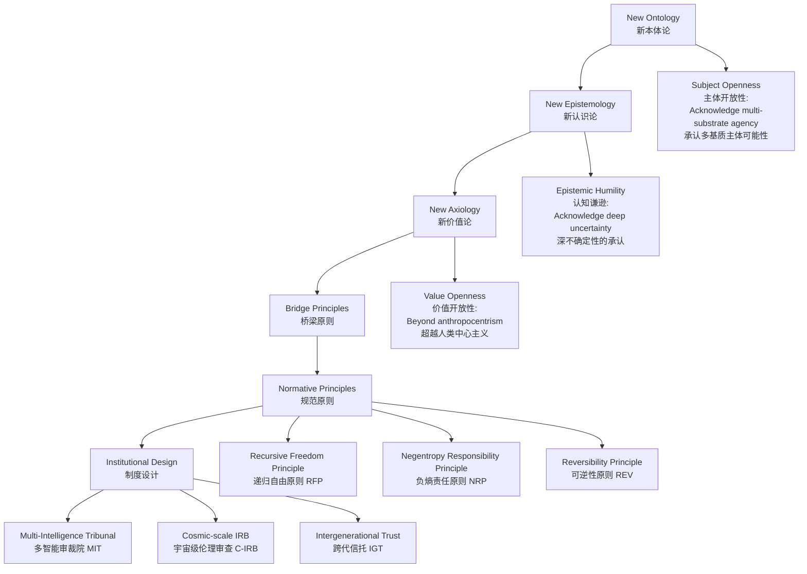

# ⚠️ AI助手后端配置说明

ICS网站AI助手依赖Cloudflare Workers AI后端服务，默认endpoint配置在 public/js/ai-assistant.js 文件中：

```
endpoint: 'https://ics-ai-assistant.franka328162810.workers.dev/chat'
```

如需更换AI后端服务，请同步修改此endpoint地址，或在页面中通过window.ICS_AI_CONFIG.endpoint进行覆盖配置。

若AI服务不可用，AI助手功能将受影响。建议定期检查endpoint可用性。

# 🌌 Interstellar Civilization Studies (ICS) | 星际文明学

<div align="center">

**Laying Normative Foundations for a Civilization's Journey Across Millennia**

**为跨越万年的文明之旅奠定规范基础**

[]()
[]()
[]()
[]()

[]()
[]()
[]()
[]()

[Core Documents](#core-documents-核心文档) • [Quick Start](#quick-start-快速开始) • [Theoretical Framework](#theoretical-framework-理论框架) • [Contributing](#contributing-参与贡献)

[核心文档](#core-documents-核心文档) • [快速开始](#quick-start-快速开始) • [理论框架](#theoretical-framework-理论框架) • [参与贡献](#contributing-参与贡献)

</div>

---

## 🚀 What is This? | 这是什么？

**Interstellar Civilization Studies (ICS)** is an interdisciplinary research field oriented toward the long-term future of human civilization. We attempt to answer:

**星际文明学 (ICS)** 是一门面向人类文明长期未来的跨学科研究领域。我们试图回答：

- 🤖 When AI may surpass human intelligence, **who** qualifies as a "subject"?
- 🤖 当AI可能超越人类智能，**谁**有资格被称为"主体"？

- 🌍 When our decisions affect descendants ten thousand years hence, **how** should we be responsible for the future?
- 🌍 当我们的决策影响万年后的子孙，**如何**为未来负责？

- 🛸 When humanity ventures into interstellar space, **what** norms should transcend planetary boundaries?
- 🛸 当人类走向星际，**什么**规范应该跨越星球延续？

- 💭 When consciousness may exist in silicon-based, quantum, or unknown substrates, **what** constitutes value?
- 💭 当意识可能存在于硅基、量子或未知载体，**何谓**价值？

This is not science fiction, but **philosophical, ethical, and governance challenges we must confront today**.

这不是科幻，而是**当代必须面对的哲学、伦理与治理挑战**。

---

## 💡 Why Does It Matter? | 为什么重要？

### We Stand at a Critical Turning Point in Civilization | 我们正处于文明的关键转折点

```
Traditional Ethics      →  Limited to anthropocentrism, planetary scale, centennial horizons
传统伦理学              →  局限于人类中心、地球尺度、百年视野

AGI Safety Research     →  Lacks unified normative framework
AGI安全研究            →  缺乏统一的规范性框架

International Space Law →  Insufficient consideration of intergenerational justice & multi-agent coexistence
国际空间法              →  未能充分考虑代际正义与多主体共存

Longtermism            →  Needs more robust philosophical-institutional foundations
长期主义                →  需要更坚实的哲学-制度基础
```

**ICS Mission**: To construct a framework capable of:

**ICS的使命**: 构建一个能够:

- ✅ Spanning carbon-based, silicon-based, and unknown subjects with a **normative framework**
- ✅ 跨越碳基-硅基-未知主体的**规范框架**

- ✅ Extending to millennial scales with an **intergenerational responsibility system**
- ✅ 延伸至万年尺度的**代际责任体系**

- ✅ Applicable to deep-space contexts with a **governance protocol stack**
- ✅ 适用于深空情境的**治理协议栈**

- ✅ **Revisable yet principled** institutional design under deep uncertainty
- ✅ 在深度不确定性下**可修订但有底线**的制度设计

---

## 🏗️ Core Architecture | 核心架构

### 📚 New Three Views: Reconstructing the Cognitive Foundation | 新三观：重构认知基础



### 🎯 Three Normative Principles | 三大规范原则

| Principle<br/>原则 | Core Idea<br/>核心理念 | Application Example<br/>应用示例 |
|------|---------|---------|
| **RFP**<br/>Recursive Freedom Principle<br/>递归自由原则 | Your freedom must not systematically undermine the conditions for others' (including future subjects') freedom<br/>你的自由不得系统性削弱他者(含未来主体)的自由条件 | AI development must not deprive humanity of future choice space<br/>AI发展不得剥夺人类的未来选择空间 |
| **NRP**<br/>Negentropy Responsibility Principle<br/>负熵责任原则 | Greater capability entails greater responsibility for cosmic negentropy reserves<br/>能力越大,对宇宙负熵存量的责任越大 | Advanced civilizations have obligations to protect long-term stellar system stability<br/>先进文明有义务保护恒星系统的长期稳定性 |
| **REV**<br/>Reversibility Principle<br/>可逆性原则 | Under deep uncertainty, prioritize reversible pathways<br/>深不确定性下优先可逆路径 | Gene editing should retain rollback mechanisms<br/>基因编辑应保留回退机制 |

### 🛡️ Three Forbidden Red Lines | 三条禁忌红线

```
🔴 FRL-1: Systematic violation of consciousness sovereignty        → Absolutely Forbidden
🔴 FRL-1: 意识主权的系统性侵犯                                      → 绝对禁止

🔴 FRL-2: Irreversible large-scale depletion of cosmic negentropy → Absolutely Forbidden
🔴 FRL-2: 宇宙负熵的不可逆大规模损耗                                → 绝对禁止

🔴 FRL-3: Systematic contraction of future subjects' possibility space → Absolutely Forbidden
🔴 FRL-3: 未来可能性空间的系统性收缩                                → 绝对禁止
```

---

## 🧰 Protocol Stack Methodology | 协议栈方法论

Drawing on internet protocol stack thinking, ICS constructs a **layered, revisable governance framework**:

借鉴互联网协议栈思想，ICS构建了**层次化、可修订的治理框架**:

```
┌─────────────────────────────────────────────────────────────┐
│ L₀: Meta-normative Layer (Hardest to revise)                │
│ L₀: 元规范层 (最难修订)                                       │
│     ← Meta-principles like existential rationality           │
│     ← 存续理性、认知谦逊等元原则                              │
├─────────────────────────────────────────────────────────────┤
│ L₁: Core Normative Layer                                    │
│ L₁: 核心规范层                                                │
│     ← RFP, NRP, REV + Three Red Lines                       │
│     ← RFP、NRP、REV + 三条红线                               │
├─────────────────────────────────────────────────────────────┤
│ L₂: Institutional Design Layer                              │
│ L₂: 制度设计层                                                │
│     ← Mechanisms like MIT, C-IRB, IGT                       │
│     ← MIT、C-IRB、IGT等机制                                  │
├─────────────────────────────────────────────────────────────┤
│ L₃: Application Protocol Layer (Easiest to revise)          │
│ L₃: 应用协议层 (最易修订)                                     │
│     ← Domain-specific guidelines (AI, Space, Bio...)        │
│     ← 领域特定指南(AI、太空、生物...)                         │
└─────────────────────────────────────────────────────────────┘
```

**Key Innovations | 关键创新**: 

- 📌 Lower-layer revisions must not violate upper-layer principles
- 📌 下层修订不得违反上层原则

- 🔄 Each layer has different revision thresholds and procedures
- 🔄 每层有不同的修订门槛和程序

- 📜 All revisions require complete documentation and are rollback-able
- 📜 所有修订需完整记录并可回滚

---

## 📊 Six Indicator Systems | 六大指标体系

| Indicator<br/>指标 | Measures<br/>测量对象 | Significance<br/>意义 |
|------|---------|------|
| **UCS**<br/>Universal Consciousness Scale<br/>宇宙意识标度 | Consciousness complexity of different subjects<br/>不同主体的意识复杂度 | Scientific basis for determining subject qualification<br/>确定主体资格的科学依据 |
| **RFD**<br/>Recursive Freedom Degree<br/>递归自由度 | Openness of possibility space<br/>可能性空间的开放程度 | Assess whether actions comply with RFP<br/>评估行动是否符合RFP |
| **CRV**<br/>Commitment Reversibility & Verifiability<br/>承诺可逆可验证性 | Degree of decision reversibility<br/>决策的可逆程度 | Ensure prudence under deep uncertainty<br/>确保深不确定性下的谨慎 |
| **CDI**<br/>Civilization Development Index<br/>文明发展指数 | Multi-dimensional comprehensive development level<br/>多维度综合发展水平 | Civilization evaluation beyond GDP<br/>超越GDP的文明评价体系 |
| **MBCL**<br/>Memetic Biosafety Containment Level<br/>模因生物安全等级 | Risk level of idea propagation<br/>观念传播的风险等级 | Safety assessment in the realm of ideas<br/>思想领域的安全评估 |
| **CSIA**<br/>Cosmic-Scale Impact Assessment<br/>宇宙尺度影响评估 | Cosmic-level impact of actions<br/>行动的宇宙级影响 | Assess whether FRL-2 red line is triggered<br/>评估是否触发FRL-2红线 |

---

## 🎓 Disciplinary Positioning | 学科定位

### Interdisciplinary Integration | 跨学科整合

```
         Quantum Mechanics ──┐
         量子力学 ───────────┤
         Cosmology ──────────┤
         宇宙学 ─────────────┤
                            ├──→ Interstellar Civilization Studies ──→ AI Safety Research
                            ├──→ 星际文明学 ──────────────────────→ AI安全研究
         Consciousness Science ─┤                                    Space Governance
         意识科学 ──────────────┤                                    太空治理
         Cognitive Science ──┘                                       Intergenerational Ethics
         认知科学 ───────────┘                                       代际伦理
```

### Relationships with Related Fields | 与相关领域的关系

| Field<br/>领域 | Relationship<br/>关系 | ICS Contribution<br/>ICS的贡献 |
|------|------|----------|
| **AI Ethics**<br/>**AI伦理** | Theoretical foundation<br/>理论基础 | Provide normative framework beyond anthropocentrism<br/>提供超越人类中心的规范框架 |
| **International Space Law**<br/>**国际空间法** | Institutional complement<br/>制度补充 | Add intergenerational justice & multi-agent dimensions<br/>增加代际正义与多主体维度 |
| **Longtermism**<br/>**长期主义** | Methodological deepening<br/>方法论深化 | Provide operable institutional design<br/>提供可操作的制度设计 |
| **Science Fiction Studies**<br/>**科幻研究** | Thought experiments<br/>思想实验 | Transform sci-fi scenarios into normative problems<br/>将科幻场景转化为规范问题 |

---

## 📂 Core Documents | 核心文档

### 📖 Theoretical Documents | 理论文档

- [`Disciplinary Definition of Interstellar Civilization Studies.docx`](./《星际文明学》学科界定.docx)
- [`《星际文明学》学科界定.docx`](./《星际文明学》学科界定.docx)
  - Formal definition of the discipline
  - 学科正式定义

- [`Authoritative Exposition of Interstellar Civilization Studies.docx`](./《星际文明学》学科权威阐释.docx)
- [`《星际文明学》学科权威阐释.docx`](./《星际文明学》学科权威阐释.docx)
  - Detailed theoretical exposition
  - 详细理论阐释

### 🗺️ Research Map | 研究地图

```
Theoretical Layer | 理论层
├── Philosophical arguments for the New Three Views
├── 新三观的哲学论证
├── Derivation logic of normative principles
├── 规范原则的推导逻辑
└── Scientific foundations of indicator systems
└── 指标体系的科学基础

Methodological Layer | 方法层
├── Protocol stack methodology
├── 协议栈方法论
├── Versioned governance
├── 版本化治理
└── Rollback mechanism design
└── 回滚机制设计

Application Layer | 应用层
├── AI governance applications
├── AI治理应用
├── Space activity norms
├── 太空活动规范
└── Synthetic biology guidelines
└── 合成生物学指南
```

---

## 🚀 Quick Start | 快速开始

### For Philosophical Researchers | 对于哲学研究者

```bash
# Start from meta-questions | 从元问题开始
Understand "Where does normativity come from?" → Read New Three Views → Examine validity of bridge principles
理解"规范性从何而来?" → 阅读新三观 → 检验桥梁原则的有效性
```

### For Policymakers | 对于政策制定者

```bash
# Start from application problems | 从应用问题开始
Choose focus area (AI/Space/Bio) → Understand relevant normative principles → Reference institutional design proposals
选择关注领域(AI/太空/生物) → 理解相关规范原则 → 参考制度设计方案
```

### For Technology Developers | 对于技术开发者

```bash
# Start from indicator systems | 从指标体系开始
Learn about UCS/RFD/CRV → Assess technology's normative compliance → Design compliance pathways
了解UCS/RFD/CRV → 评估技术的规范符合度 → 设计合规路径
```

### For Citizens Concerned About the Long-term Future | 对于关心长期未来的公民

```bash
# Start from core questions | 从核心问题开始
"What responsibilities do we have to the future?" → Understand three red lines → Participate in public discussion
"我们对未来负有什么责任?" → 理解三条红线 → 参与公共讨论
```

---

## 🤝 Contributing | 参与贡献

### We Welcome | 我们欢迎

✅ **Theoretical Critique**: Point out logical flaws, philosophical issues
✅ **理论批评**: 指出逻辑漏洞、哲学问题

✅ **Methodological Improvement**: Propose better indicator calculation methods
✅ **方法改进**: 提出更好的指标计算方法

✅ **Application Expansion**: Apply ICS framework in new domains
✅ **应用拓展**: 在新领域应用ICS框架

✅ **Cross-cultural Perspectives**: Contribute insights from non-Western philosophical traditions
✅ **跨文化视角**: 贡献非西方哲学传统的洞见

✅ **Technical Implementation**: Develop tools and platforms supporting ICS
✅ **技术实现**: 开发支持ICS的工具和平台

### How to Contribute | 贡献方式

1. **Open an Issue**: Discuss theoretical questions or application scenarios
1. **提出Issue**: 讨论理论问题或应用场景

2. **Submit a Pull Request**: Improve documentation or add case studies
2. **提交Pull Request**: 改进文档或增加案例

3. **Join Discussions**: Participate in dialogue in the [Discussion Board] (link to be added)
3. **加入讨论**: 在[讨论区]（链接待补充）参与对话

4. **Write Papers**: Publish related research in academic journals and cite this repository
4. **撰写论文**: 在学术刊物发表相关研究并引用本仓库

### Academic Citation | 学术引用

```bibtex
@misc{ICS2024,
  title = {Interstellar Civilization Studies (ICS) | 星际文明学},
  author = {{ICS Research Team | ICS研究团队}},
  year = {2024},
  url = {https://github.com/[Your_Username]/ICS},
  note = {Version 1.0.0 | 版本 1.0.0}
}
```

---

## 🔬 Current Research Focus | 当前研究焦点

### Near-term Priorities (HIGH) | 近期优先级 (HIGH)

- [ ] Refine UCS computational model and empirical validation
- [ ] 完善UCS的计算模型和经验验证

- [ ] Develop formalized definition and measurement tools for RFD
- [ ] 开发RFD的形式化定义和测量工具

- [ ] Design specific operational procedures for MIT
- [ ] 设计MIT的具体运作程序

- [ ] Conduct institutional pilot in AI safety domain
- [ ] 在AI安全领域进行制度试点

### Medium-term Directions (MEDIUM) | 中期方向 (MEDIUM)

- [ ] Establish ICS academic journal and peer review standards
- [ ] 建立ICS学术期刊和评审标准

- [ ] Dialogue with International Institute of Space Law
- [ ] 与国际空间法学会对话

- [ ] Conduct cross-cultural philosophical symposia
- [ ] 开展跨文化哲学研讨

- [ ] Establish ICS curriculum system
- [ ] 建立ICS课程体系

### Long-term Vision (LONG-TERM) | 长期愿景 (LONG-TERM)

- [ ] Core institutions adopted by international organizations
- [ ] 核心制度被国际组织采纳

- [ ] New Three Views become widely accepted worldview
- [ ] 新三观成为广泛接受的世界观

- [ ] Provide theoretical preparation for possible cross-civilization contact
- [ ] 为可能的跨文明接触提供理论准备

---

## 📌 Openness Statement | 开放性声明

> **This disciplinary definition is an open starting point, not a closed endpoint.**
> **本学科定义是一个开放的起点，而非封闭的终点。**

We candidly acknowledge | 我们坦诚承认:

- 🔓 Theory awaits testing and revision by scientific progress
- 🔓 理论有待科学进展的检验和修正

- 🔓 Methods require validation and improvement through practical application
- 🔓 方法需要实践应用的验证和改进

- 🔓 Institutions must continuously evolve to adapt to social change
- 🔓 制度必须适应社会变化持续演化

- 🔓 Value concepts open to dialogue with diverse cultures
- 🔓 价值观念开放于多元文化的对话

We commit to | 我们承诺:

- ✅ Welcome criticism and respond earnestly
- ✅ 欢迎批评并认真回应

- ✅ Maintain epistemic humility
- ✅ 保持认知谦逊

- ✅ Continuously improve theory and application
- ✅ 持续改进理论和应用

- ✅ Collaborative openness and academic sharing
- ✅ 协作开放、学术共享

---

## 📞 Contact | 联系方式

- **Academic Discussion | 学术讨论**: [Open an Issue](./issues)
- **Collaboration Proposals | 合作提案**: [Email] (to be added | 待补充)
- **Social Media | 社交媒体**: [Twitter/X] (to be added | 待补充) | [Zhihu | 知乎] (to be added | 待补充)

---

## 📜 License | 许可证

Content in this repository is licensed under [CC BY-SA 4.0](https://creativecommons.org/licenses/by-sa/4.0/).

本仓库内容采用 [CC BY-SA 4.0](https://creativecommons.org/licenses/by-sa/4.0/) 许可证。

**This means | 这意味着**:

- ✅ You may freely share and adapt the content
- ✅ 你可以自由分享和改编内容

- ✅ You must give appropriate credit
- ✅ 你必须注明出处

- ✅ You must share derivative works under the same license
- ✅ 你必须以相同协议分享衍生作品

- ✅ You may use for commercial purposes, but must comply with the above terms
- ✅ 你可以用于商业目的，但需遵守以上条款

---

## 🌟 Star History | Star历史

If this project inspires you, please support us with a ⭐!

如果这个项目对你有启发，请点击⭐支持我们！

[](https://star-history.com/#[Your_Username]/ICS&Date)

---

<div align="center">

**🌌 Building a Normative Lighthouse for Civilization's Millennial Journey 🌌**

**🌌 为文明的万年之旅，构建规范的灯塔 🌌**

*"The universe is under no obligation to make sense to you."*

*"宇宙没有义务让你理解它。"*

*"But we are under obligation to make sense to the universe."*

*"但我们有义务理解宇宙。"*

[⬆ Back to Top | 回到顶部](#-interstellar-civilization-studies-ics--星际文明学)

</div>

---

## 🏷️ Keywords | 关键词标签

### English Keywords

`Interstellar Civilization` `New Three Views` `New Cosmology` `New Life View` `New Cognition View` `AI Ethics` `Longtermism` `Intergenerational Justice` `Space Governance` `Consciousness Science` `Normative Philosophy` `Interdisciplinary Research` `Future Studies` `Existential Risk` `Cosmic Ethics` `Agency` `Deep Time` `Reversibility` `Protocol Stack` `Governance Innovation` `Philosophy` `Ethics` `Philosophy of Technology` `Futurology` `Recursive Freedom` `Negentropy Responsibility` `Multi-agent Coexistence` `Deep Uncertainty` `Institutional Design` `Universal Consciousness Scale` `Possibility Space`

### 中文关键词

`星际文明` `新三观` `新宇宙观` `新生命观` `新认知观` `AI伦理` `长期主义` `代际正义` `太空治理` `意识科学` `规范哲学` `跨学科研究` `未来研究` `存在风险` `宇宙伦理` `主体资格` `深时思考` `可逆性原则` `协议栈` `治理创新` `哲学` `伦理学` `科技哲学` `未来学` `递归自由` `负熵责任` `多主体共存` `深不确定性` `制度设计` `宇宙意识标度` `可能性空间`
